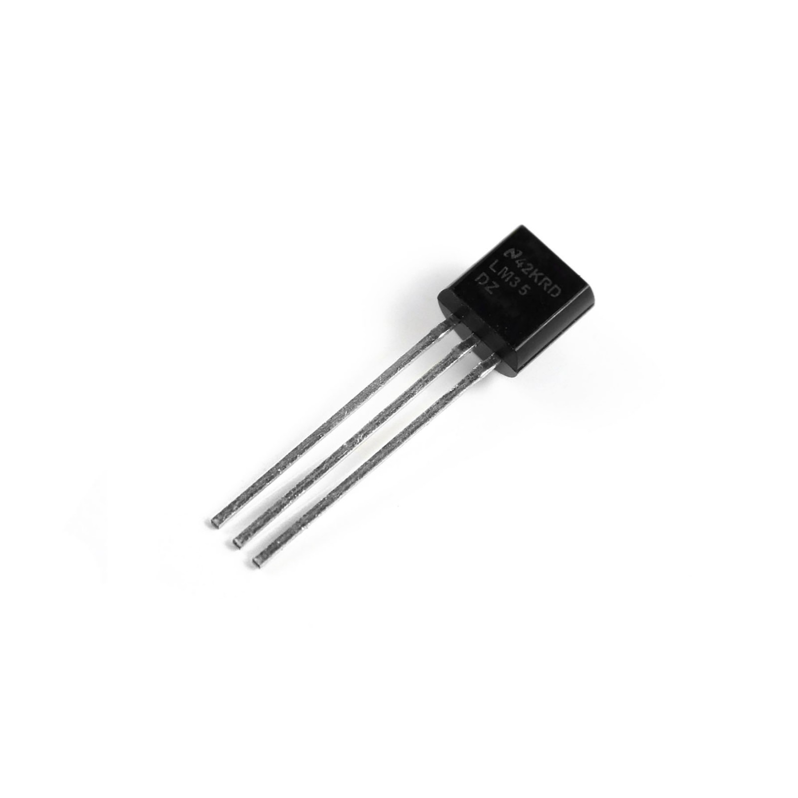

# LM34 Temperature Sensor 🌡️

This directory contains information about the LM34 temperature sensor used in the project.

## Specifications

- **Calibrated Directly in Degrees Fahrenheit**
- **Linear 10.0 mV/°F Scale Factor**
- **Accuracy**: 1.0°F Assured (at 77°F)
- **Measurement Range**: -50°F to 300°F
- **Suitable for Remote Applications**
- **Operating Voltage**: 5 to 30 Volts
- **Current Drain**: Less Than 90µA

## Description

The LM34 Temperature Sensor is a critical component of this project, providing accurate temperature readings. It is calibrated directly in degrees Fahrenheit and has a linear 10.0 mV/°F scale factor, ensuring precise measurements. With an accuracy of 1.0°F assured at 77°F, it offers reliable performance across a wide range of temperatures from -50°F to 300°F. This sensor is suitable for remote applications, making it versatile for various projects. It operates within a voltage range of 5 to 30 volts and has a low current drain of less than 90µA.

### Where to Buy

You can purchase LM34 temperature sensors from online stores like:

For more details and to purchase, visit [LM34 Temperature Sensor on Amazon](https://www.amazon.com/s?k=lm34+temperature+sensor).
